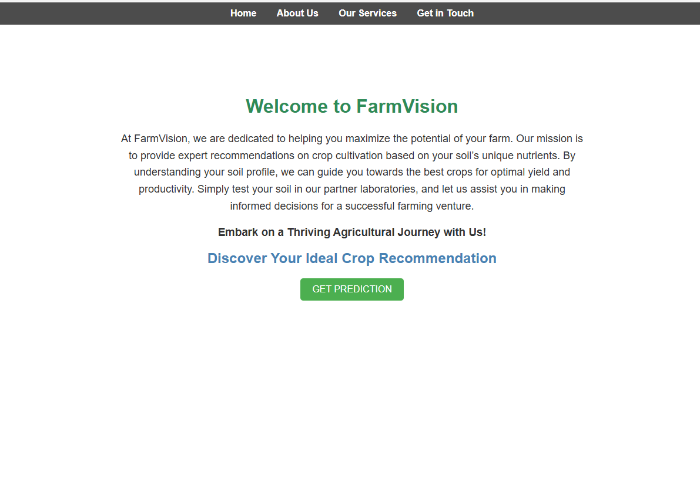
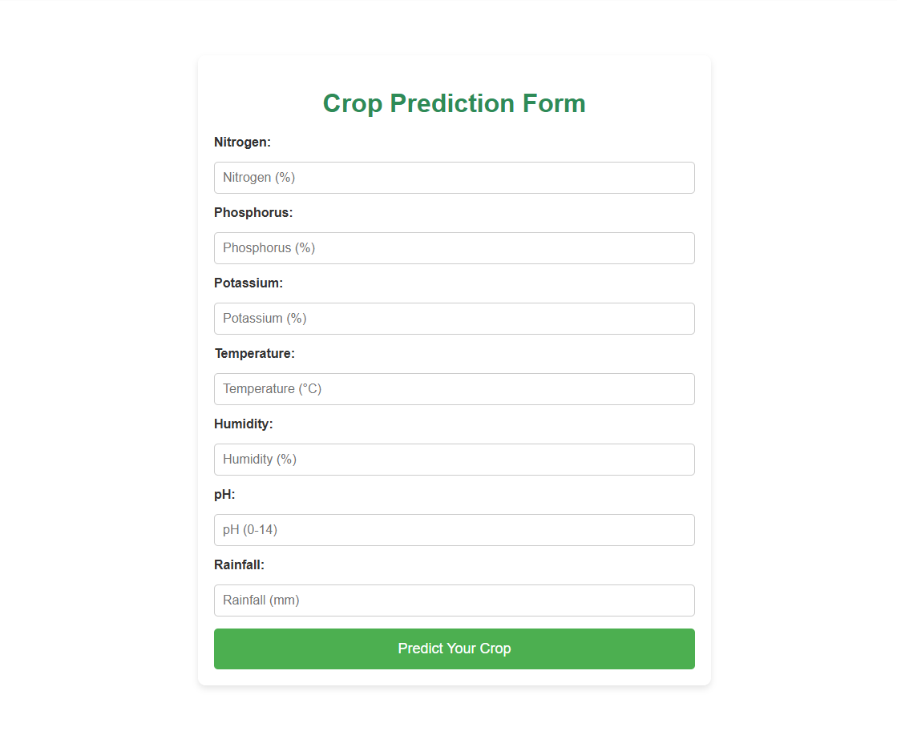

# Crop Recommendation System

## Introduction

In the realm of agriculture, where traditional knowledge meets cutting-edge technology, the Crop Recommendation System is revolutionizing how farmers choose crops. By considering the mineral composition of the soil, including potassium, nitrogen, and phosphorous, as well as factors like humidity, temperature, and rainfall, this data-driven project empowers farmers with precise recommendations. In this blog, we'll delve deeper into how these critical factors play a pivotal role in the decision-making process.

## The Role of Soil Minerals

1. **Potassium**  
   Potassium is a vital nutrient for plant growth, contributing to root development, disease resistance, and overall plant health. Soil tests reveal potassium levels, helping the system suggest crops that thrive in either high or low potassium conditions.

2. **Nitrogen**  
   Nitrogen is essential for chlorophyll production and overall plant growth. Soil nitrogen content influences crop recommendations, as different crops have varying nitrogen requirements.

3. **Phosphorous**  
   Phosphorous is crucial for root development and flowering. Soil phosphorous levels guide the system in suggesting crops that can optimize the available phosphorous.

## Environmental Variables

1. **Humidity**  
   Crop success is closely tied to humidity levels. High humidity can lead to moisture-related diseases, while low humidity can result in stress for certain crops. The Crop Recommendation System factors in local humidity conditions to make precise recommendations.

2. **Temperature**  
   Temperature affects the rate of plant growth and flowering. Some crops thrive in cooler conditions, while others prefer warmer climates. The system considers local temperature data for tailored suggestions.

3. **Rainfall**  
   Rainfall during the growing season is essential for crop success. The Crop Recommendation System accounts for historical rainfall patterns and monsoon data to provide recommendations that align with local water availability.

## Screenshots

### Crop Recommendation System Interface

### Detailed Input

### Example Recommendation Output

## Conclusion

The Crop Recommendation System represents the pinnacle of data-driven agriculture. By accounting for soil minerals, humidity, temperature, and rainfall, it empowers farmers to make informed decisions about crop selection. This approach not only boosts productivity but also contributes to more sustainable and resilient farming practices, which are essential for the future of agriculture in an ever-changing world. As technology continues to advance, projects like these demonstrate the transformative power of data in agriculture.
